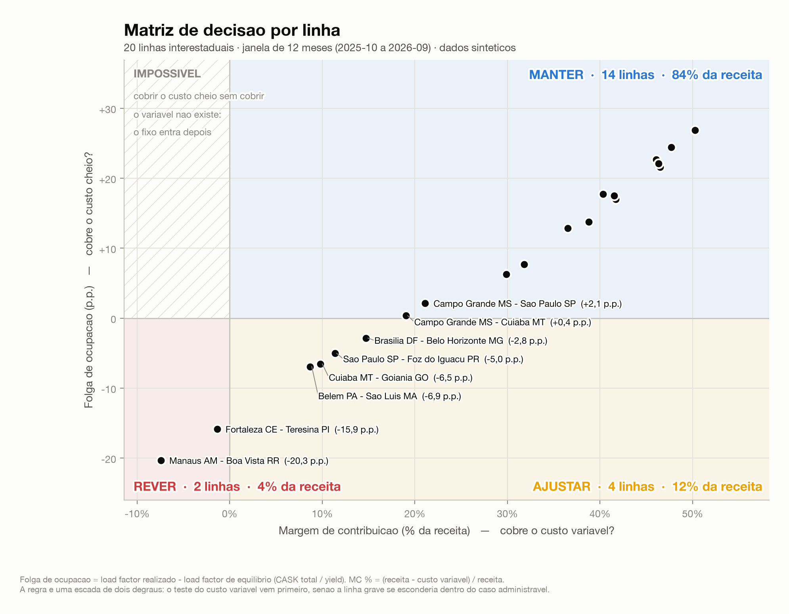
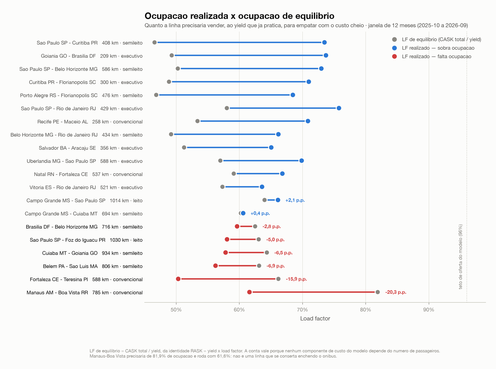
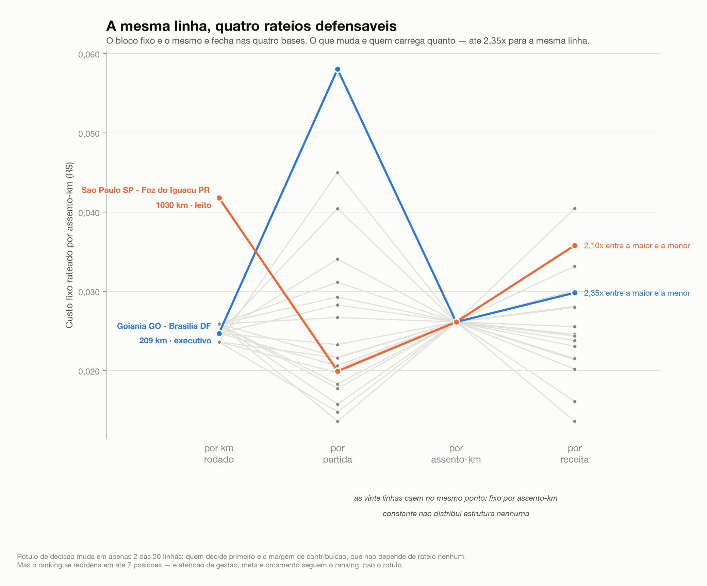
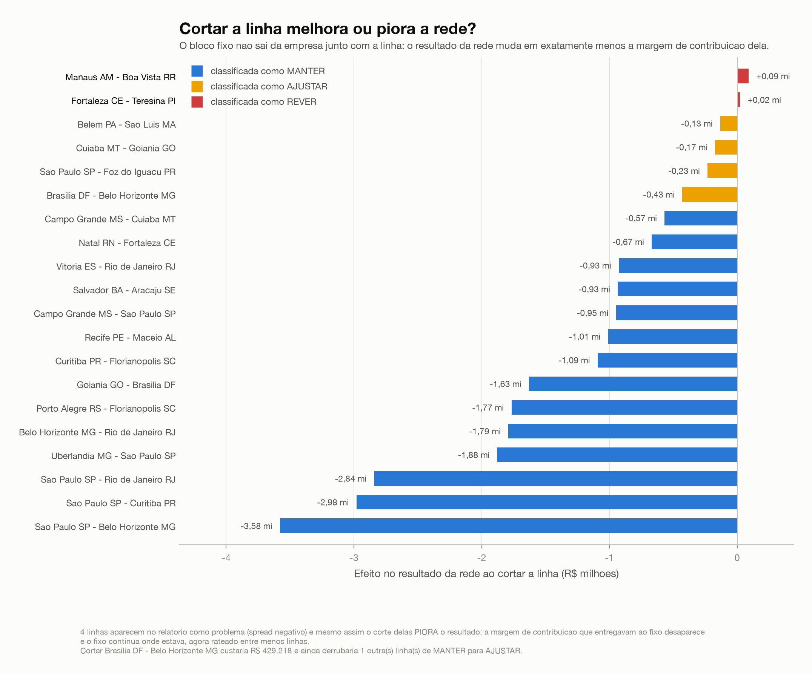
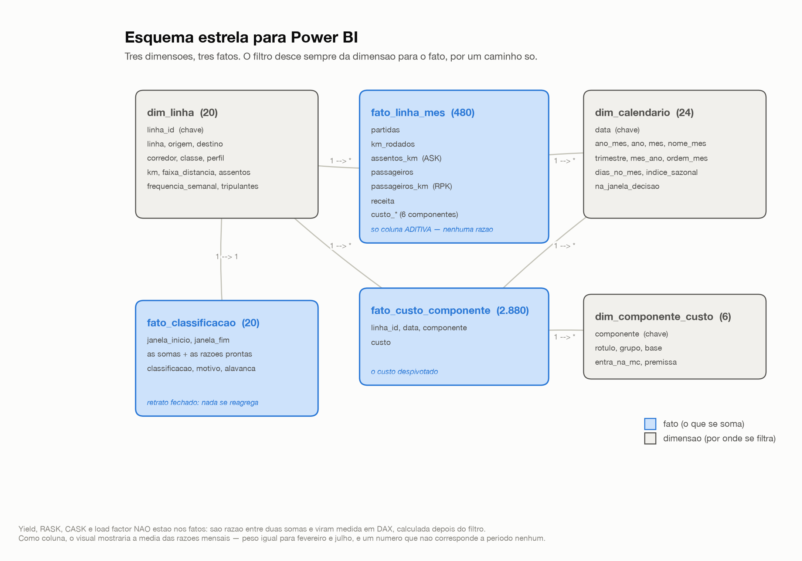

# margem-linhas-rodoviarias

Margem por linha de ônibus interestadual: modelo de custo, indicadores de
_revenue management_ (RASK, CASK, yield, load factor) e uma decisão explícita
sobre cada linha — **manter, ajustar ou rever**. Saída em Excel formatado e em
CSVs prontos para Power BI, com as medidas DAX escritas.

> **Os dados são sintéticos.** As cidades e as distâncias são reais porque é o
> que torna o exercício legível; frequência, ocupação, tarifa e custo são
> gerados por código a partir de premissas declaradas em um único arquivo.
> Nada aqui vem de sistema, planilha ou base de empresa nenhuma.

```bash
uv sync && uv run margem tudo
```

> Este repositório é a base de uma série, não uma peça fechada. O que já existe
> e o que vem a seguir estão no **[ROADMAP](ROADMAP.md)**; a ligação entre cada
> premissa e a fonte pública que a calibraria está em
> **[docs/fontes-publicas.md](docs/fontes-publicas.md)**.

---

## O que o modelo conclui

20 linhas, 24 meses (10/2024 a 09/2026), 480 registros. Decisão tomada sobre os
**12 últimos meses somados**:

| Decisão | Linhas | Receita da janela | % da receita | Critério |
|---|---:|---:|---:|---|
| 🟩 **MANTER** | 14 | R$ 57,3 mi | 83,9% | RASK ≥ CASK cheio |
| 🟨 **AJUSTAR** | 4 | R$ 8,2 mi | 12,1% | cobre o variável, não o fixo rateado |
| 🟥 **REVER** | 2 | R$ 2,8 mi | 4,0% | não cobre nem o variável |

A rede fecha com **MC 33,0%** e **resultado 15,3%**, load factor de **65,8%**,
yield de R$ 0,2236 por passageiro-km e spread RASK−CASK de R$ 0,0224 por
assento-km.



A matriz desenha a própria regra: cada eixo é um dos dois testes, e as linhas de
zero são os cortes de verdade. O quadrante superior esquerdo fica vazio **por
construção** — não existe linha que cubra o custo cheio sem cobrir o variável, e
é isso que faz a classificação ser uma escada de dois degraus e não quatro
caixas.

As seis linhas fora do MANTER:

| Linha | Km | Classe | LF | Yield | RASK | CASK total | Spread | MC % | Decisão | Alavanca |
|---|---:|---|---:|---:|---:|---:|---:|---:|---|---|
| Manaus AM – Boa Vista RR | 785 | Convencional | 61,6% | 0,1499 | 0,0923 | 0,1228 | −0,0305 | −7,4% | **REVER** | ocupação e preço |
| Fortaleza – Teresina | 588 | Convencional | 50,3% | 0,1555 | 0,0782 | 0,1029 | −0,0247 | −1,4% | **REVER** | ocupação e preço |
| São Paulo – Foz do Iguaçu | 1.030 | Leito | 58,0% | 0,3600 | 0,2090 | 0,2270 | −0,0181 | 11,4% | **AJUSTAR** | ocupação |
| Belém – São Luís | 806 | Semileito | 56,2% | 0,2197 | 0,1234 | 0,1386 | −0,0152 | 8,7% | **AJUSTAR** | ocupação e preço |
| Cuiabá – Goiânia | 934 | Semileito | 57,8% | 0,2119 | 0,1225 | 0,1363 | −0,0139 | 9,8% | **AJUSTAR** | ocupação e preço |
| Brasília – Belo Horizonte | 716 | Semileito | 59,6% | 0,2226 | 0,1328 | 0,1391 | −0,0063 | 14,7% | **AJUSTAR** | ocupação |

E duas que cobrem o custo cheio **no limite** — Campo Grande–São Paulo
(spread R$ 0,0075) e Campo Grande–Cuiabá (R$ 0,0008): são MANTER hoje e viram
AJUSTAR com uma alta de diesel de um dígito.

---

## A metodologia

### 1. O dataset sintético

A demanda de cada linha-mês sai de quatro fatores multiplicativos, todos
declarados em [`margem/config.py`](margem/config.py):

```
passageiros = ocupação base × sazonalidade^amplitude × tendência × ruído
```

...e é cortada no **teto de oferta** de 96%. Cada fator existe para evitar um
defeito específico de dado fabricado:

- **A sazonalidade tem amplitude própria por linha.** O índice mensal é o mesmo
  (julho 1,22 e janeiro 1,18 no topo; março 0,87 e maio 0,88 no fundo), mas
  entra elevado a um expoente da linha: Goiânia–Brasília é corporativa e achata
  a curva (0,4), São Paulo–Foz é lazer e exagera o pico (1,6). Vinte linhas
  subindo e descendo juntas, no mesmo tamanho, é a assinatura mais óbvia de
  dado inventado.
- **O expoente é renormalizado.** `0,87^0,4 = 0,95`: achatar a sazonalidade
  _eleva_ a média. Sem dividir pela média, a linha corporativa terminaria mais
  cheia do que o catálogo declara, só por ser corporativa.
- **O teto de ocupação.** Sem ele, o pico de julho produz load factor acima de
  100% — o erro que denuncia qualquer dataset sintético na primeira conferida.
- **A oferta segue os dias do mês.** Partidas = frequência semanal × dias / 7.
  Por isso o vale da rede é _fevereiro_ e não maio: fevereiro tem menos dias,
  logo menos partidas. É queda de oferta, não de demanda — e o load factor
  mostra exatamente isso.

A tarifa parte de um valor de referência em R$/passageiro-km por classe
(convencional 0,175 até leito 0,400), **cai com a distância** pelo fator
`(500/km)^0,18` — custo de terminal, embarque e venda se dilui em percurso
maior — e recebe um fator de pressão competitiva por linha (0,92 em São
Paulo–Rio, onde a aérea concorre; 1,02 em São Paulo–Foz). A tarifa média
realizada ainda acompanha o mix: sobe no pico, quando sobra menos promocional.

### 2. O modelo de custo

Seis componentes, cada um com a **base explícita** — e é a base que organiza
tudo. Custo por km e custo por partida não se somam antes de saber quantos km e
quantas partidas o mês teve.

| Componente | Base | Premissa | % do custo |
|---|---|---|---:|
| Combustível | km | diesel R$ 6,15/l ÷ consumo da classe | 42,2% |
| Tripulação | **partida** | jornada × R$ 31/h × motoristas + diária + pernoite | 17,0% |
| Manutenção | km | R$ 0,58/km × fator de agressividade do corredor | 11,9% |
| Pneus | km | R$ 0,26/km | 5,0% |
| Pedágio | km | R$/km do corredor (0,225 no Sudeste, 0,010 no Norte) | 3,0% |
| **Fixo rateado** | rateio por km | R$ 990 mil/mês ÷ km rodados do mês | 21,0% |

O bloco fixo (garagem, administração e vendas, depreciação e seguros) é rateado
pelos km rodados de cada linha no mês — a soma do rateado fecha com o total
declarado, e [um teste](testes/test_custos.py) garante isso. Ele **fica fora da
margem de contribuição**: margem com fixo dentro leva a cortar linha que cobre o
variável de sobra, e o fixo continuaria existindo depois do corte, agora rateado
entre menos linhas.

### 3. O achado: o degrau dos 600 km

Acima de 600 km entra o segundo motorista, e a tripulação **por km** dá um salto:

| Linha | Km | Tripulação R$/km | Variável R$/km |
|---|---:|---:|---:|
| Uberlândia – São Paulo | 588 | 0,615 | 3,801 |
| Campo Grande – Cuiabá | 694 | **1,547** | 4,771 |

Dezoito por cento a mais de distância, **151% a mais de tripulação por km** — e
a receita por km não acompanha, porque o yield _cai_ com a distância. As quatro
linhas AJUSTAR e uma das MANTER-no-limite estão todas acima do degrau. Não é
efeito colateral da premissa: é a razão pela qual linhas logo acima do limite de
dupla tripulação são estruturalmente mais difíceis, e vê-la explícita é metade
do valor do modelo.

### 4. Os indicadores

```
ASK  = assentos × km × partidas          RPK = passageiros × km
LF   = RPK / ASK                         yield = receita / RPK
RASK = receita / ASK = yield × LF        CASK = custo / ASK
MC   = receita − custo variável          spread = RASK − CASK total
```

A identidade **RASK = yield × LF** é a que dá a leitura de gestão: receita por
assento oferecido tem dois caminhos, preço e ocupação, e o modelo aponta qual
dos dois está faltando em cada linha (a coluna _Alavanca_, comparada contra a
mediana da rede). `margem conferir` mede as cinco identidades no dataset
inteiro — o erro máximo é da ordem de 1e-17.

A mesma identidade, resolvida para o load factor, dá o indicador mais acionável
do modelo:

```
yield × LF = CASK   ⟹   LF de equilíbrio = CASK total / yield
```

É a ocupação que a linha precisaria ter, **ao preço que ela já pratica**, para
empatar com o custo. Diz exatamente o que o spread diz, em unidade que a
operação entende: "faltam 8 pontos de ocupação" mobiliza uma reunião de um jeito
que "spread de −R$ 0,015 por assento-km" não mobiliza. Um teste fixa que as duas
leituras nunca discordam.

A conta só vale porque **nenhum componente de custo deste modelo depende do
número de passageiros** — todos têm base km ou base partida. Se entrasse uma
comissão por passageiro, o custo subiria junto com a ocupação e o equilíbrio
viraria ponto fixo, não divisão.



Manaus–Boa Vista precisaria de **81,9%** de ocupação e roda com 61,6%: não é uma
linha que se conserta enchendo o ônibus. Campo Grande–Cuiabá, no outro extremo,
está 0,4 p.p. acima do próprio equilíbrio — cobre o custo cheio por uma margem
que a próxima alta de diesel consome.

**Razão nunca se agrega.** Yield, RASK, CASK e load factor de um conjunto de
linhas-mês são divisão das somas, nunca a média das razões: a média dá peso
igual a um fevereiro e a um julho e devolve um número que não corresponde a
período nenhum. Todo recorte do projeto passa por uma função só
([`indicadores._razoes`](margem/indicadores.py)), e é a mesma regra que obriga
esses indicadores a serem **medida** em DAX e nunca coluna calculada.

### 5. A decisão

Dois degraus de cobertura de custo, sobre os **12 últimos meses somados**:

- **MANTER** — `spread ≥ 0`. A linha paga o variável e ainda o pedaço de
  estrutura que lhe foi rateado.
- **AJUSTAR** — `MC > 0` e `spread < 0`. A linha **contribui**: tirada da malha,
  o fixo que ela cobria se redistribui entre as outras e piora todas. O que se
  ajusta é frequência, classe, horário ou preço — não a existência da linha.
- **REVER** — `MC ≤ 0`. Cada partida destrói caixa, e volume não resolve:
  vender mais assento com margem de contribuição negativa piora o resultado.

Duas decisões de método importam aqui. **A ordem dos testes**: MC negativa
também produz spread negativo, então o teste do variável vem primeiro — na ordem
inversa, o caso grave ficaria escondido dentro do caso administrável. **A
janela de 12 meses**: classificar no mês isolado faria uma linha de lazer
alternar entre MANTER e REVER três vezes ao ano, e nenhuma decisão comercial se
toma assim.

---

## O rateio decide mais do que parece

O modelo acima rateia o custo fixo por km rodado, e o README original já dizia
que isso é **convenção, não verdade**. A pergunta natural é: quanto essa
convenção decide?

Quatro bases são igualmente defensáveis numa reunião — km, partida, assento-km e
receita — e as quatro fecham com o mesmo bloco fixo de R$ 990 mil/mês. Mas cada
uma penaliza sistematicamente um arquétipo de linha, e isso é **álgebra, não
simulação**:

| Base | `fixo / ASK` vira | Quem paga a conta |
|---|---|---|
| **km** | `(F/km_total) / assentos` | o **leito**: 26 poltronas contra 46 do convencional → 1,77× mais |
| **partida** | `(F/partidas) / (km × assentos)` | a **linha curta**: nada dilui o custo por partida |
| **assento-km** | `F / ASK_total` — constante | ninguém: some da decisão |
| **receita** | `F × R_i/R` | ninguém: vira um piso único de MC% |



O ponto onde as vinte linhas **convergem** é a base assento-km. Uma base que
atribui o mesmo fixo por assento-km a todo mundo não distribui estrutura — soma
uma constante ao CASK. Testes fixam as quatro identidades, inclusive a de que
ratear por receita reduz a decisão a `MC% ≥ F/R`, exata no grão do mês.

**O achado não é o que eu esperava, e é melhor assim.** O *rótulo* quase não
muda: só 2 das 20 linhas trocam de classificação, porque quem decide primeiro é
a margem de contribuição, que não depende de rateio nenhum. O que muda é a
*magnitude* — o fixo por assento-km da mesma linha varia até **2,35×**, e
Goiânia–Brasília anda **7 posições** no ranking. Meta, atenção de gestão e
orçamento seguem o ranking, não o rótulo.

## Cortar a pior linha costuma piorar a rede

Tirar uma linha da malha não tira o custo fixo dela: o bloco continua inteiro e
se redistribui entre as que ficam. Disso sai uma identidade exata —

```
Δ resultado da rede = − margem de contribuição da linha cortada
```

— e ela não depende do spread, do CASK nem da classificação.



Seis linhas aparecem no relatório como problema. **Cortar quatro delas piora o
resultado**, porque a margem de contribuição que entregavam ao fixo desaparece e
o fixo continua onde estava. Brasília–BH está classificada como AJUSTAR e
custaria **R$ 429 mil** — e ainda derrubaria Campo Grande–Cuiabá de MANTER para
AJUSTAR, sem que nada tenha mudado nessa segunda linha.

É a cascata que quase nunca entra na conta do corte, e é o que transforma
"cortar a pior" num processo que se repete: cada corte encarece quem fica e
fabrica a próxima candidata.

```bash
uv run margem rateio        # o efeito das quatro bases
uv run margem corte L15     # o que acontece ao cortar uma linha
```

---

## As saídas

### `saida/margem-linhas-rodoviarias.xlsx`

Seis abas, formatadas célula a célula com **openpyxl** (e não `to_excel`, porque
o destinatário é alguém que vai abrir o arquivo e decidir, não um script):

| Aba | O que tem |
|---|---|
| **Resumo** | KPIs da rede, contagem por decisão e as linhas em risco |
| **Linhas** | a janela de 12 meses por linha, com semáforo, ocupação de equilíbrio, escala de cor no MC% e barra no load factor |
| **Mensal** | o fato linha × mês completo, 480 registros |
| **Custos** | as premissas com a base de cada componente e o custo unitário por linha |
| **Dicionário** | a fórmula, a unidade e a leitura de cada indicador |
| **Metodologia** | como o dataset foi gerado, dentro do próprio arquivo — planilha circula desacompanhada |

Moeda com duas casas, percentual com uma e R$/assento-km com **quatro** — esses
últimos são centavos, e com duas casas todas as linhas virariam "0,12" e a
diferença entre elas desapareceria.

### `saida/powerbi/` — esquema estrela

```
dim_linha ─┬─ fato_linha_mes ──┬─ dim_calendario
           ├─ fato_custo_componente ─── dim_componente_custo
           └─ fato_classificacao
```



**Os fatos guardam apenas o que é aditivo** — partidas, ASK, RPK, passageiros,
receita e custo por componente. Nenhuma razão. A exceção é
`fato_classificacao`, e é deliberada: aquele arquivo é o retrato de uma janela
já fechada, com uma linha por linha de ônibus, e nada ali será somado entre
linhas.

### `powerbi/medidas.dax`

56 medidas comentadas: as bases aditivas, os indicadores unitários, margem e
resultado, inteligência de tempo (`SAMEPERIODLASTYEAR`, janela móvel com
`DATESINPERIOD`), a classificação em `SWITCH`, os cartões de decisão, a ocupação
de equilíbrio e o **rateio alternativo** — que re-rateia o mesmo bloco fixo por
outra base dentro do contexto de filtro, respondendo no próprio relatório se a
linha continuaria parecendo ruim sob outra convenção contábil. Todas com
`DIVIDE` em vez de `/`, porque `DIVIDE` devolve BLANK no denominador zero
enquanto `/` devolve Infinito, que contamina qualquer total que o contenha. O
cabeçalho do arquivo traz a ordem de importação e a lista de relacionamentos.

### `saida/imagens/` — as figuras

Cinco figuras em **PNG (200 dpi)** para publicar e **SVG** para reeditar:
`matriz-decisao`, `load-factor-equilibrio`, `esquema-estrela`,
`rateio-por-base` e `ganho-do-corte`.

A paleta das classes é **azul / amarelo / vermelho, não verde / amarelo /
vermelho**. O semáforo óbvio falha em daltonismo: medido em OKLab, o par
verde–vermelho fica a ΔE 4,1 sob deuteranopia — praticamente a mesma cor para
cerca de 8% dos leitores homens. O trio adotado mede ΔE 19,8 no pior par, e
mesmo assim nenhuma região depende só da cor: todas carregam rótulo escrito.

Duas decisões que valem registro: a matriz **desenha a regra** em vez de plotar
yield × load factor com uma fronteira de equilíbrio — essa fronteira teria de ser
única para a rede, e o CASK varia de R$ 0,10 a R$ 0,23 por assento-km entre um
convencional e um leito, então a curva contradiria a cor de vários pontos. E no
SVG, os rótulos que carregam contorno viram curva (limitação do matplotlib);
título, eixos e marcações continuam editáveis.

---

## Como rodar

```bash
export UV_PROJECT_ENVIRONMENT="$HOME/.venvs/margem-linhas-rodoviarias"
uv sync

uv run margem tudo          # gera, calcula e exporta Excel + CSVs
uv run margem linhas        # o catálogo e o custo unitário por linha
uv run margem indicadores   # a tabela de decisão
uv run margem excel         # só a planilha
uv run margem powerbi       # só os CSVs
uv run margem imagens       # só as figuras (PNG + SVG)
uv run margem rateio        # o efeito da base de rateio
uv run margem corte L15     # o efeito de cortar uma linha
uv run margem conferir      # as identidades do modelo e o fecho do rateio
uv run pytest               # 73 testes
```

Nenhum subcomando depende de estado deixado pelo anterior e não há pasta de
dados intermediários: o dataset é determinístico (semente em `config.py`), então
recomputar os 480 registros é mais barato e mais seguro do que guardar um
arquivo que pode ficar velho em relação às premissas.

> O `UV_PROJECT_ENVIRONMENT` fora de `~/Documents` não é frescura: pastas
> sincronizadas por serviços de nuvem marcam os `.pth` do venv como ocultos, e o
> Python 3.12 ignora `.pth` oculto de propósito — o pacote some do `sys.path` e
> o console script quebra com `ModuleNotFoundError`.

## Estrutura

```
margem/
  config.py        todas as premissas: seed, período, custos, limiares
  linhas.py        o catálogo das 20 linhas
  sintetico.py     o gerador: sazonalidade, tendência, ruído, teto de oferta
  custos.py        o modelo de custo e o rateio do fixo
  indicadores.py   ASK, RPK, yield, RASK, CASK, MC, spread, classificação
  excel.py         a pasta de trabalho formatada
  powerbi.py       o esquema estrela
  malha.py         bases de rateio e simulação de corte
  graficos.py      as cinco figuras
  pipeline.py      a CLI
powerbi/medidas.dax
saida/             versionada de propósito: Excel, CSVs e imagens sem rodar nada
testes/            73 testes
```

## Limites declarados

- **Todo passageiro viaja o trecho inteiro**, então RPK = passageiros × km. Um
  modelo com seções intermediárias exigiria a ocupação seção a seção para
  ratear a capacidade; sem isso, qualquer "ocupação por seção" seria rateio
  inventado — e é exatamente o tipo de número que todo mundo usa e ninguém
  consegue defender em reunião.
- **A linha é medida em um sentido.** O vazio do retorno de feriado não está
  modelado.
- **O rateio do fixo por km é convenção, não verdade** — e agora está medido:
  a seção sobre rateio mostra quanto a escolha da base muda o ranking. Nenhuma
  decisão de cortar linha deve sair só dele, e é por isso que a margem de
  contribuição aparece sempre ao lado.
- **A perda de tráfego de conexão não está modelada.** A simulação de corte
  redistribui o custo fixo, mas a malha aqui não é conectada: inventar uma taxa
  de recaptura produziria um número que parece medido sem ser.
- **A elasticidade-preço não está modelada.** A tarifa varia com o mix e com a
  pressão competitiva declarada, não com uma curva de resposta da demanda.
  Estimar elasticidade exigiria variação de preço que este dataset não tem — e
  inventá-la produziria um número que pareceria medido sem ser.
